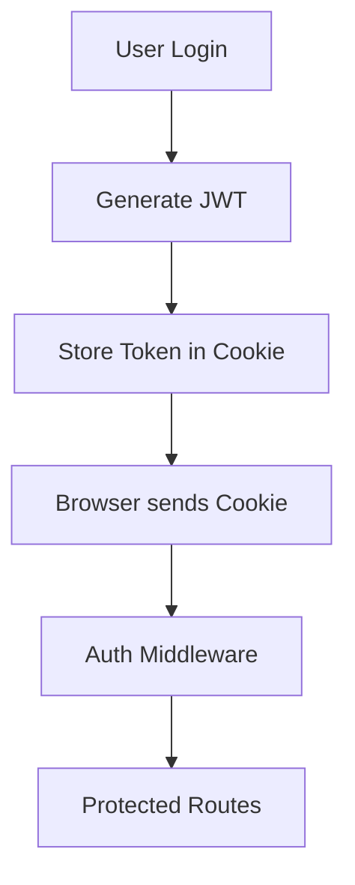
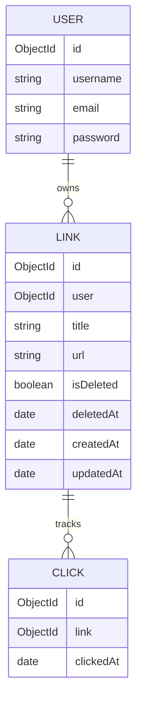
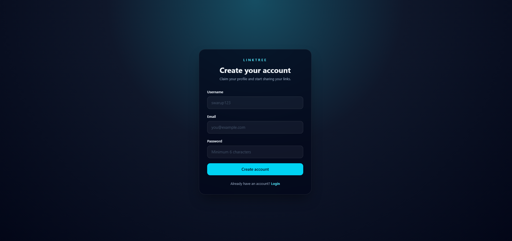
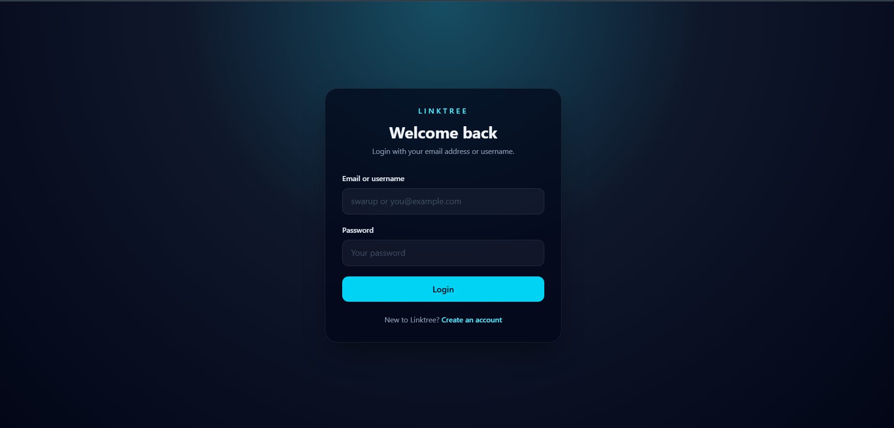
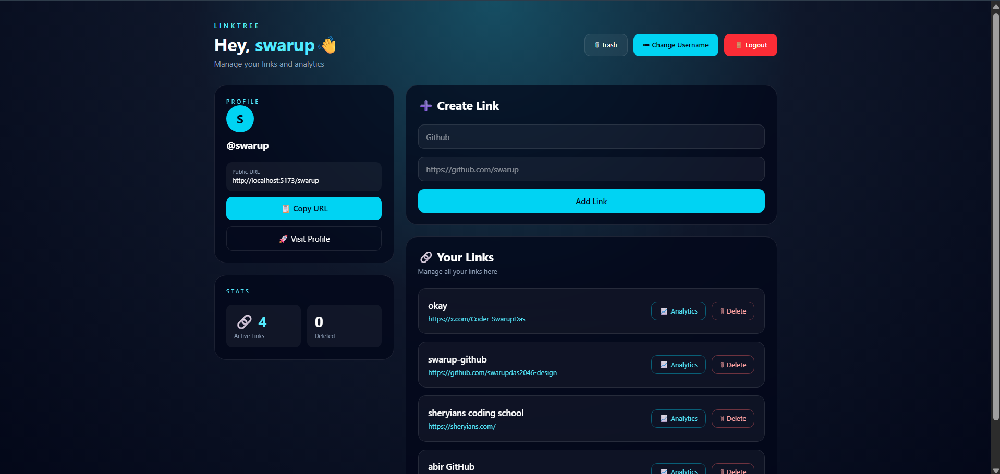
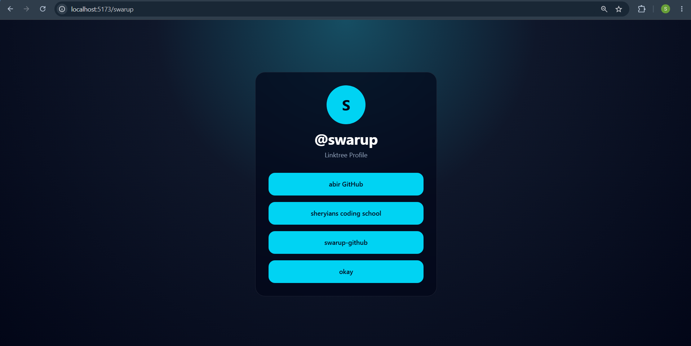
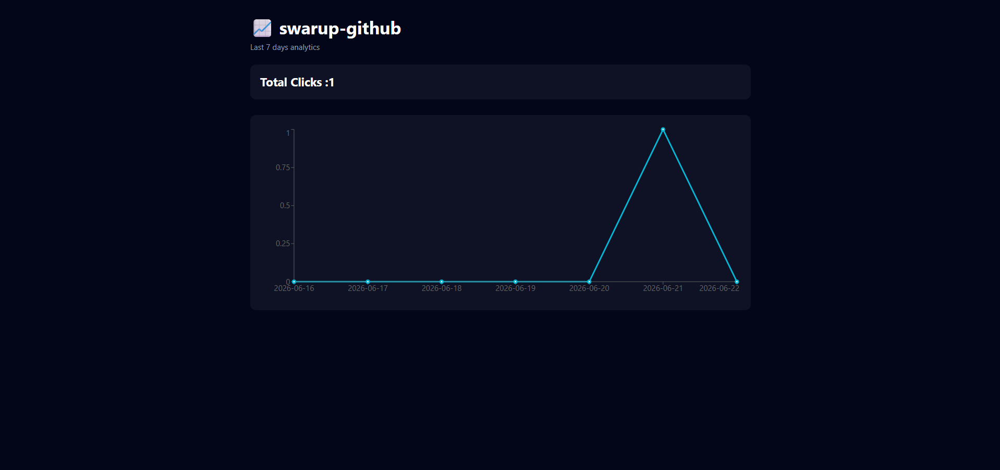
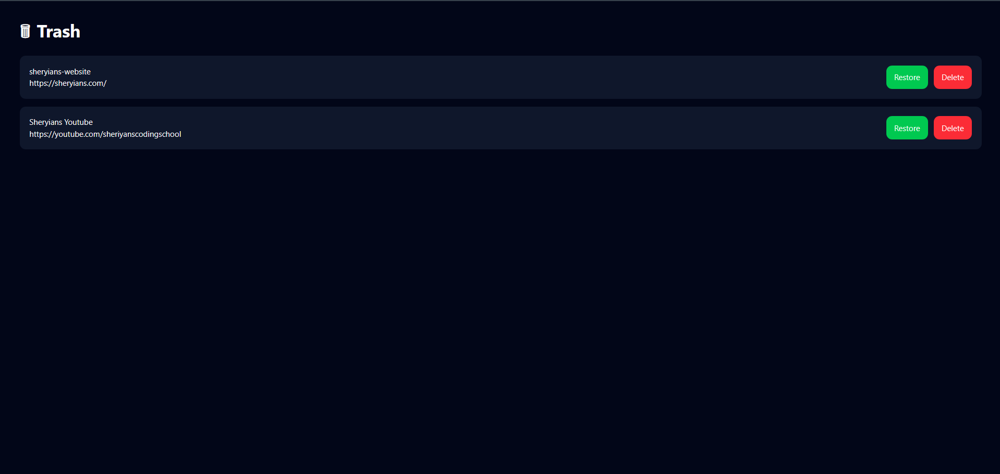

<div align="center">

# 🌳 LinkTree

### A production-ready full-stack LinkTree Clone built using React, Node.js, Express.js and MongoDB.

Create your own public profile, share multiple links, track visitors, view analytics and manage deleted links.

<br>


</div>

---

# 📌 Table of Contents

- Project Overview
- Problem Statement
- Features
- Tech Stack
- Folder Structure
- Authentication Flow
- Database Design
- Environment Variables
- Installation Guide
- Local Development Setup
- Deployment Guide
- API Documentation
- HTTP Status Codes
- Screenshots
- Troubleshooting
- Contributing
- Author

---

# 📖 Project Overview

LinkTree is a modern web application that allows users to create a public profile containing multiple links.

Instead of sharing many URLs separately, users can share only one profile URL.

Example

```bash
https://domain.com/swarup
```

Visitors can open this page and access all social media links, portfolio links, resumes, websites and blogs from one place.

---

# ❓ Problem Statement

Most social platforms allow users to place only a single URL inside their profile bio.

Example

Instagram

Twitter

Threads

Youtube

GitHub Profile

Users often need to share:

GitHub

LinkedIn

Resume

Portfolio

Twitter

Instagram

Personal Website

Managing all these links individually becomes inconvenient.

This project solves that problem by providing:

✔ Single public profile

✔ Unlimited links

✔ Analytics

✔ Link management

✔ Trash recovery system

---

# 🎯 Features

## Authentication

Register User

Login User

JWT Authentication

Cookie Based Authentication

Protected Routes

Logout

---

## Username Management

Claim Username

Update Username

Unique Username Validation

---

## Dashboard

View Profile

Copy Profile URL

Create Links

Delete Links

Restore Links

Permanent Delete

Manage Trash

---

## Public Profile

Accessible without login

Displays active links

Supports unlimited links

---

## Analytics

Track visitor clicks

Daily click counter

Last 7 days statistics

Visual charts using Recharts

---

## Trash System

Soft Delete

Restore Link

Permanent Delete

---

# 🚀 Tech Stack

| Category         | Technologies  |
| ---------------- | ------------- |
| Frontend         | React 19      |
| Routing          | React Router  |
| Styling          | TailwindCSS   |
| HTTP Client      | Axios         |
| Charts           | Recharts      |
| Authentication   | JWT           |
| Backend          | Node.js       |
| Server           | Express.js    |
| Database         | MongoDB       |
| ODM              | Mongoose      |
| Cookies          | Cookie Parser |
| Logging          | Morgan        |
| Deployment       | Render        |
| Frontend Hosting | Vercel        |

---

# 📂 Frontend Folder Structure

```bash
frontend
│
├── public
│
├── src
│
│   ├── context
│   │
│   │── AuthProvider.jsx
│   │── AuthContext.js
│
│
│
│   ├── features
│   │
│   │── analytics
│   │
│   │── auth
│   │
│   │── dashboard
│   │
│   │── home
│   │
│   │── trash
│   │
│   │── username
│
│
│
│   ├── shared
│   │
│   │── api
│   │
│   │── components
│
│
│
│   ├── app.routes.jsx
│
│   ├── App.jsx
│
│   └── main.jsx
│
│
├── package.json
│
└── vite.config.js
```

---

# 📂 Backend Folder Structure

```bash
backend
│
├── src
│
│
├── config
│
│   └── config.js
│
│
├── controllers
│
│   ├── auth.controller.js
│
│   └── link.controller.js
│
│
├── middlewares
│
│   └── auth.middleware.js
│
│
├── models
│
│   ├── user.model.js
│
│   ├── link.model.js
│
│   └── click.model.js
│
│
├── routes
│
│   ├── auth.routes.js
│
│   ├── link.routes.js
│
│   └── index.routes.js
│
│
├── validators
│
│
├── db
│
│   └── mongoose.js
│
│
├── app.js
│
├── server.js
│
│
├── package.json
│
└── .env

```

---

# 🔐 Authentication Flow



---

# 🗄 Database Design

### Users Collection

```javascript
{
  (_id, username, email, password);
}
```

---

### Links Collection

```javascript
{
  (_id, user, title, url, isDeleted, deletedAt, createdAt);
}
```

---

### Clicks Collection

```javascript
{
  (_id, link, clickedAt);
}
```

---

# 📊 Database ER Diagram



---

# ⚙ Environment Variables

## Backend

Create `.env` inside backend directory

```env

PORT=3000


MONGO_URI=your_mongodb_connection_string


JWT_SECRET=your_secret_key


CLIENT_URL=http://localhost:5173


NODE_ENV=development


```

### Production Backend

```env


PORT=3000


MONGO_URI=your_mongodb_connection_string


JWT_SECRET=your_secret_key


CLIENT_URL=https://link-tree-jade-psi.vercel.app


NODE_ENV=production


```

---

## Frontend

Create `.env` inside frontend directory

### Local Development

```env

VITE_API_URL=http://localhost:3000/api

```

### Production Deployment

```env

VITE_API_URL=https://your-backend.onrender.com/api


```

Axios automatically reads this variable.

```javascript
const apiClient = axios.create({
  baseURL: import.meta.env.VITE_API_URL,

  withCredentials: true,
});
```

This setup allows the same codebase to work in both local and production environments.

---

# 💻 Installation Guide

## Clone Repository

```bash


git clone https://github.com/swarupdas2046-design/linktree.git


```

---

## Backend Setup

```bash


cd backend


npm install


```

Run backend server

```bash


npm run dev


```

Backend runs at

```text


http://localhost:3000


```

---

## Frontend Setup

```bash


cd frontend


npm install


```

Run frontend

```bash


npm run dev


```

Frontend runs at

```text


http://localhost:5173


```

---

# 🏃 Local Development Setup

### Start Backend

```bash


cd backend


npm run dev


```

---

### Start Frontend

```bash


cd frontend


npm run dev


```

---

### Open Browser

```text


http://localhost:5173


```

---

### Database

You can use

MongoDB Compass

or

MongoDB Atlas

---

# ☁ Deployment Guide

## Backend Deployment

Hosting Platform

Render

---

Steps

Create Web Service

Connect GitHub Repository

Add Environment Variables

Deploy Latest Commit

---

Required Variables

```env


PORT=3000


MONGO_URI=


JWT_SECRET=


CLIENT_URL=https://link-tree-jade-psi.vercel.app


NODE_ENV=production


```

---

## Frontend Deployment

Hosting Platform

Vercel

---

Steps

Import GitHub Repository

Framework

Vite

---

Environment Variable

```env


VITE_API_URL=https://your-backend.onrender.com/api


```

Deploy

Done ✅

---

# 🌐 API Documentation

## Authentication Routes

| Method | Endpoint                 | Description    | Protected |
| ------ | ------------------------ | -------------- | --------- |
| POST   | /api/auth/register       | Register User  | ❌        |
| POST   | /api/auth/login          | Login User     | ❌        |
| GET    | /api/auth/me             | Current User   | ✅        |
| POST   | /api/auth/logout         | Logout User    | ✅        |
| PATCH  | /api/auth/claim-username | Claim Username | ✅        |

---

## Link Routes

| Method | Endpoint                     | Description           | Protected |
| ------ | ---------------------------- | --------------------- | --------- |
| POST   | /api/links                   | Create Link           | ✅        |
| GET    | /api/links/me                | Get User Links        | ✅        |
| GET    | /api/links/deleted           | Deleted Links         | ✅        |
| DELETE | /api/links/:linkId           | Soft Delete           | ✅        |
| PATCH  | /api/links/:linkId/restore   | Restore Link          | ✅        |
| DELETE | /api/links/:linkId/purge     | Permanent Delete      | ✅        |
| POST   | /api/links/:linkId/click     | Record Click          | ❌        |
| GET    | /api/links/:linkId/analytics | Last 7 Days Analytics | ✅        |
| GET    | /api/links/:username         | Public Links          | ❌        |

---

# 📥 Request Examples

## Register User

### Request

```json


POST /api/auth/register


{


"username":"swarup",


"email":"swarupdas2046@gmail.com",


"password":"12345678"


}


```

---

### Response

```json
{
  "message": "User registered successfully",

  "user": {
    "id": "686...",

    "username": "swarup",

    "email": "swarupdas2046@gmail.com"
  }
}
```

---

## Login User

### Request

```json


POST /api/auth/login


{


"identifier":"swarup",


"password":"12345678"


}


```

---

### Response

```json
{
  "message": "Login successful",

  "user": {
    "id": "686...",

    "username": "swarup",

    "email": "swarupdas2046@gmail.com"
  }
}
```

---

---

# 📊 HTTP Status Codes

| Status Code | Meaning               |
| ----------- | --------------------- |
| 200         | Request Successful    |
| 201         | Resource Created      |
| 400         | Bad Request           |
| 401         | Unauthorized          |
| 403         | Forbidden             |
| 404         | Resource Not Found    |
| 409         | Conflict              |
| 429         | Too Many Requests     |
| 500         | Internal Server Error |

---

# 🔒 Authentication Strategy

This project uses JWT Authentication.

After successful login,

backend generates JWT token.

Token is stored inside an HttpOnly Cookie.

Cookie Configuration

```javascript
res.cookie("token", token, {
  httpOnly: true,

  secure: true,

  sameSite: "none",

  maxAge: 604800000,
});
```

Protected APIs use

```javascript
authMiddleware;
```

which verifies

```javascript
req.cookies.token;
```

before allowing access.

---

# 📸 Screenshots

## Register Page



---

## Login Page



---

## Dashboard



---

## Public Profile



---

## Analytics



---

## Trash Management



---

# 🧪 Postman Collection Testing

Authentication

- Register

- Login

- Current User

- Logout

Links

- Create Link

- Get My Links

- Delete Link

- Trash

- Restore

- Purge

- Analytics

- Click Tracking

---

# 🐞 Troubleshooting

### Cookies not being sent

Check

```javascript
withCredentials: true;
```

---

### CORS Error

Verify

```env


CLIENT_URL=http://localhost:5173


```

or

```env


CLIENT_URL=https://link-tree-jade-psi.vercel.app


```

---

### MongoDB Connection Failed

Check

```env


MONGO_URI=


```

---

### Unauthorized Error

Verify

```javascript
req.cookies.token;
```

---

### Frontend API Issue

Check

```env


VITE_API_URL=http://localhost:3000/api


```

for local development

and

```env


VITE_API_URL=https://your-backend.onrender.com/api


```

for production deployment

---

# 👨‍💻 Author

## Swarup Das

MERN Stack Developer

Backend Enthusiast

India 🇮🇳

📧 Email

```text


swarupdas2046@gmail.com


```

💻 GitHub

```text


https://github.com/swarupdas2046-design


```

---

# 🙏 Acknowledgements

Sheriyans Coding School

KODEX Batch

---

<div align="center">

Made with ❤️ by Swarup Das

⭐ If you liked this project, don't forget to star the repository.

</div>
